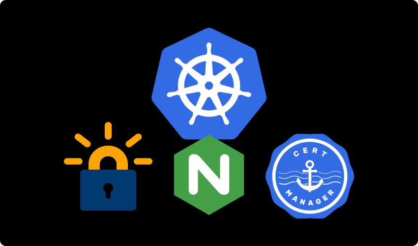
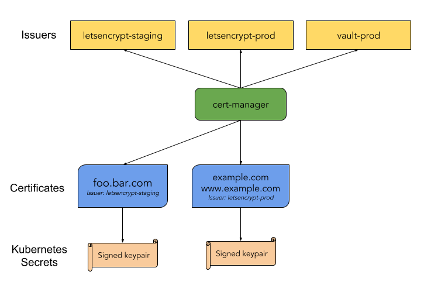

# Free SSL on Kubernetes with Cert-manager



SSL certificate is a single most crucial component enabling secure communication between server and client. When deploying a fleet of services on Kubernetes, securing both the internal and external network traffic can be tricky. To our rescue comes, **Cert-manager**, a Kubernetes native certificate manager.

<br/>

At the end of this tutorial we'll have secure cluster Ingress traffic with a free SSL certificate issued from **Let's Encrypt** using cert-manager.

## What is cert-manager?

Cert-manager is a native Kubernetes certificate management controller. It can help with issuing certificates from a variety of sources, such as Let’s Encrypt, HashiCorp Vault, self-signed certs etc.

<br/>

It will ensure certificates are valid and up to date, and attempt to renew certificates at a configured time before expiry.

<br/>

Well cert-manager comprises of a variety of components and extensions, but we'll discuss those that are required for this tutorial. Check out related concepts [here](https://cert-manager.io/docs/concepts/).

<br/>

- **Issuer** - component that talk to `CA authorirites` and request a certificate on demand.

- **Certificate** - it defines a certificate request as Kubernetes resource, and this request is pushed to `Issuer`, and issued certificate is then stored as a k8s secret object.

<br/>



## Requirements

Kubernetes cluster installed with Nginx-ingress and accessible with kubectl is required. I am using Kind to deploy a test kubernetes cluster, but you can choose any distribution of kubernetes.

For using Kind, refer it's installation docs.

## Installing cert-manager with regular manifests

Install the `CustomResourceDefinitions` and `cert-manager` itself:

```bash
kubectl create ns cert-manager

kubectl -n cert-manager apply -f https://github.com/jetstack/cert-manager/releases/download/v1.3.1/cert-manager.yaml
```

<br/>

You can download any other stable release for `cert-manager` from it's [releases-page](https://github.com/jetstack/cert-manager/).

<br/>

It's a good practice to store the yaml files that you apply to cluster, in case something goes wrong you can restore the state of cluster by re-applying them. To store the cert-manager manifest we just applied

```bash
curl -LO https://github.com/jetstack/cert-manager/releases/download/v1.3.1/cert-manager.yaml

mv cert-manager.yaml cert-manager-1.3.1.yaml
```

To verify the installation

```bash
kubectl -n cert-manager get all
```

```
NAME                                           READY   STATUS    RESTARTS   AGE
pod/cert-manager-86548b886-s64ql               1/1     Running   0          2m42s
pod/cert-manager-cainjector-6d59c8d4f7-mg25z   1/1     Running   0          2m43s
pod/cert-manager-webhook-578954cdd-9xjj7       1/1     Running   0          2m42s

NAME                           TYPE        CLUSTER-IP      EXTERNAL-IP   PORT(S)    AGE
service/cert-manager           ClusterIP   10.105.244.77   <none>        9402/TCP   2m46s
service/cert-manager-webhook   ClusterIP   10.107.103.46   <none>        443/TCP    2m44s

NAME                                      READY   UP-TO-DATE   AVAILABLE   AGE
deployment.apps/cert-manager              1/1     1            1           2m42s
deployment.apps/cert-manager-cainjector   1/1     1            1           2m43s
deployment.apps/cert-manager-webhook      1/1     1            1           2m42s

NAME                                                 DESIRED   CURRENT   READY   AGE
replicaset.apps/cert-manager-86548b886               1         1         1       2m42s
replicaset.apps/cert-manager-cainjector-6d59c8d4f7   1         1         1       2m43s
replicaset.apps/cert-manager-webhook-578954cdd       1         1         1       2m42s
```

## Deploying sample app

For testing the working of issued SSL certificate, let's deploy a simple REST api in the cluster as well. Once deployed we'll route the traffic to this app using ingress.

<br/>

The source code for the sample app is inside [app](https://github.com/Akshit8/k8s-certmanager/tree/master/app) directory and infrastructure files are contained inside [infra](https://github.com/Akshit8/k8s-certmanager/tree/master/infra) folder.

<br/>

```bash
kubectl apply -f ./deployment.yaml
kubectl apply -f ./service.yaml
```

Do make sure service and deployment components are up and running.

## Setting up domain and ingress controller

Since we'll obtain SSL certificate from let's encrypt, in order to verify ownership of the domain, let's encrypt will send a [ACME](https://cert-manager.io/docs/configuration/acme/) challenge. So before setting up Issuer and certifcate we need to point our domain name to our cluster.

<br/>

If you are using a cloud provider point domain to the load balancer, for kind cluster or any bare metal setup pointing to public IP of host machine will work fine.

<br/>

Also make sure the ingress controller is working and accepting traffic from the domain. To do so visit `your-domain.com`, and you should be able to see a 404 Not Found page. This indicates there are no routes to `/` and the ingress controller is running.

```yaml
apiVersion: networking.k8s.io/v1
kind: Ingress
metadata:
  annotations:
    kubernetes.io/ingress.class: "nginx"
  name: certmanager-app-ingress

  rules:
    - host: yourdomain.com
      http:
        paths:
          - path: /
            pathType: Prefix
            backend:
              service:
                name: certmanager-app-service
                port:
                  number: 80
```

Copy the above code to `ingress.yaml` and apply it in default namespace.

```bash
kubectl apply -f ./ingress.yaml
```

## Let's issue a free SSL!

Files used in this section is present in [certmanager](https://github.com/Akshit8/k8s-certmanager/tree/master/certmanager) dir.

**Step 1 is to create a Let's Encrypt Issuer for our cluster** <br/>

With creating a ClusterIssuer, allows us to issue and manage certificate in any namespace.

```bash
kubectl apply -f issuer.yaml
```

Verify the issuser is running and set to to make request.

```bash
kubectl describe clusterissuer letsencrypt-cluster-issuer
```

```
Name:         letsencrypt-cluster-issuer
Namespace:
Labels:       <none>
Annotations:  <none>
API Version:  cert-manager.io/v1
Kind:         ClusterIssuer

Status:
  Acme:
    Last Registered Email:  your-email@email.com
    Uri:                    https://acme-v02.api.letsencrypt.org/acme/acct/107894884
  Conditions:
    Last Transition Time:  2021-04-30T17:40:12Z
    Message:               The ACME account was registered with the ACME server
    Reason:                ACMEAccountRegistered
    Status:                True
    Type:                  Ready
Events:                    <none>
```

**Step 2 is to issue a certificate for our domain** <br/>

```bash
kubectl apply -f certificate.yaml
```

Verify if the certificate has been issued.

```bash
kubectl describe certificate certmanager-app
```

```
Events:
  Type    Reason     Age    From          Message
  ----    ------     ----   ----          -------
  Normal  Issuing    2m22s  cert-manager  Issuing certificate as Secret does not exist
  Normal  Generated  2m22s  cert-manager  Stored new private key in temporary Secret resource "certmanager-app-z88vv"
  Normal  Requested  2m22s  cert-manager  Created new CertificateRequest resource "certmanager-app-hnhn6"
  Normal  Issuing    104s   cert-manager  The certificate has been successfully issued
```

A tls secret would have been successfully created.

```bash
kubectl get secrets
```

```
NAME                       TYPE                                  DATA   AGE
cert-manager-app-tls       kubernetes.io/tls                     2      84m
```

**Step 3 is to update the ingress to enforce issued SSL** <br/>

Copy the ingress configuration from [certmanager/ingress.yaml](https://github.com/Akshit8/k8s-certmanager/blob/master/certmanager/ingress.yaml) and paste it inside `ingress.yaml`

```bash
kubectl apply -f ./ingress.yaml
```

Open the link https://your-domain.com inside browser and you'll be able to see the lock sign ensuring that SSL certificate is installed and payload to & from server is encrypted.

## Conclusion

While their are many ways to setup SSL certificates inside your cluster, I like to use certmanager as it's

- Easy to install.
- Support for ACME (Let's Encrypt), HashiCorp Vault, Venafi, self signed and internal certificate authorities.
- Provide easy to use tools to manage certificates.

## Author

**Akshit Sadana <akshitsadana@gmail.com>**

- Github: [@Akshit8](https://github.com/Akshit8)
- LinkedIn: [@akshitsadana](https://www.linkedin.com/in/akshit-sadana-b051ab121/)
